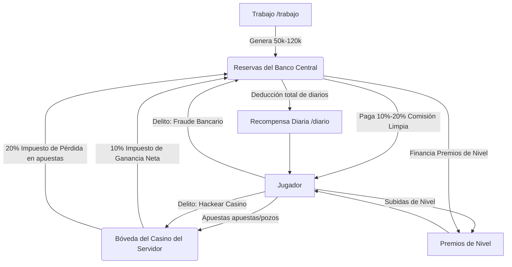

<div align="center">
  <h1>🎨 Sketchbot</h1>
  <p>Un bot de Discord premium multifuncional desarrollado en Node.js, impulsado por Supabase, con inteligencia artificial integrada y un ecosistema macroeconómico cerrado único.</p>
</div>

**Sketchbot** es una sofisticada plataforma para comunidades de Discord. Cuenta con un sistema de economía cerrado, minijuegos interactivos de azar, niveles y XP por voz, una tienda integrada por RCON con servidores de Minecraft, y un módulo de inteligencia artificial local.

---

## 🏛️ El Ecosistema Macroeconómico Cerrado (Suma Cero)

A diferencia de los bots de economía convencionales que acuñan monedas del aire sin límites, Sketchbot implementa una **macroeconomía circular de circuito cerrado** basada en dos reservas centrales:



### 1. El Banco del Servidor (`/banco`)
El banco central actúa como la reserva fiscal del servidor y el sustento de la comunidad:
*   **Aporte de Trabajo (`/trabajo`):** Cada tarea genera entre **50,000 y 120,000 monedas** que se inyectan en el banco. El trabajador recibe una comisión limpia de entre el **10% y el 20%** de ese total.
*   **Subsidio Diario (`/diario`):** Se financia enteramente con las reservas del banco.
    *   **Gestión de Quiebra Real:** Si las reservas del banco descienden por debajo del premio de un usuario, el comando falla informando elegantemente que el banco central está temporalmente en quiebra y motivando a la comunidad a hacer `/trabajo` para restaurar los fondos comunes.
*   **Premios de Nivel:** Las recompensas financieras por subir de nivel se debitan físicamente del banco central.
*   **Intrusión delictiva:** El banco es vulnerable a malversación mediante la opción de **Fraude al Banco** de `/crimen`. Las multas por crímenes fallidos se depositan de vuelta en el banco.

### 2. El Casino del Servidor (`/casino`)
El casino opera de forma independiente y posee su propia bóveda financiera:
*   **Juegos Incorporados:** Al apostar en `/blackjack`, `/minas`, `/torre`, `/cara-cruz` o `/smash`, la apuesta del jugador se deposita físicamente en el casino.
*   **Tasa Impositiva sobre Pérdidas:** Cuando un jugador pierde, el casino retiene el 100% de la apuesta, pero tributa un **20% de impuesto de pérdida** que se descuenta del casino y se transfiere al banco central.
*   **Tasa Impositiva sobre Ganancias:** Cuando un jugador gana, el premio neto se le paga desde la bóveda del casino y se aplica un **10% de impuesto a las ganancias** sobre el profit neto, debitado del casino y transferido al banco.
*   **Intrusión delictiva:** El casino puede ser hackeado mediante la opción de **Hackear Casino** en `/crimen`. Si no cuenta con fondos suficientes para el botín, se activa el sistema de bancarrota interactivo.

---

## 🚀 Características y Comandos

### 🪙 Economía y Macroeconomía
*   `/balance` - Consulta tu saldo actual de monedas en efectivo.
*   `/banco` - Visualiza el estado de las arcas del banco central, políticas fiscales e histórico.
*   `/casino` - Consulta el saldo en bóveda del casino y los impuestos activos.
*   `/depositar` [cantidad] - Guarda tus monedas en tu cuenta bancaria personal.
*   `/retirar` [cantidad] - Retira monedas de tu cuenta personal a tu efectivo.
*   `/transfer` [usuario] [cantidad] - Envía monedas de tu efectivo a otro miembro.
*   `/trabajo` - Realiza tareas del servidor para generar reservas y ganar tu comisión.
*   `/diario` - Reclama tu recompensa diaria financiada por el banco central.
*   `/crimen` - Comete actividades ilícitas (Robar jugador, Hackear Casino, Fraude al Banco).

### 🎲 Minijuegos e Interacciones Premium
*   `/blackjack` [apuesta] - Juega una mano clásica de 21 contra el dealer con botones interactivos y resolución automática anti-AFK.
*   `/minas` [apuesta] [minas] - Encuentra gemas en un tablero de 3x3 evitando las bombas ocultas. Permite retiro manual, victoria perfecta y expiración por inactividad.
*   `/torre` [apuesta] - Escala una torre donde cada nivel multiplica tu ganancia actual, con riesgo de colapso total.
*   `/cara-cruz` [apuesta] [elección] - Clásico cara o cruz para duplicar tu dinero.
*   `/smash` - Sistema de apuestas multijugador hosteadas para partidas de Super Smash Bros.

### 🌟 Niveles y XP por Voz
*   **Ganancia en Canales de Voz (`voiceXpService.js`):** El bot otorga XP aleatoria cada minuto a los usuarios activos en los canales de voz.
*   **Premios por Subida de Nivel:** Al subir de nivel, los usuarios reciben recompensas en monedas pagadas directamente desde `server_bank` y roles temáticos automatizados.
*   `/manage-xp` - Permite a los administradores añadir, remover o establecer niveles y XP a los usuarios.

### 🛒 Tienda Minecraft (RCON)
*   `/store` - Abre la tienda virtual para canjear tus créditos por artículos de Minecraft.
*   `/storeConfig` - Administra los artículos de la tienda.
*   `/swap` - Convierte tus monedas a créditos para gastar en la tienda.

---

## 🛠️ Instalación y Configuración

### Requisitos Previos
*   [Node.js](https://nodejs.org/) (v22 o superior).
*   Una instancia de [Supabase](https://supabase.com/).
*   Un servidor de Discord y credenciales de desarrollador.

### 1. Variables de Configuración
Crea un archivo llamado `config.json` en el directorio raíz del proyecto:
```json
{
  "token": "DISCORD_BOT_TOKEN",
  "clientId": "DISCORD_APPLICATION_CLIENT_ID",
  "guildId": "DISCORD_GUILD_ID",
  "supabase": {
    "url": "https://TU_PROYECTO.supabase.co",
    "serviceRoleKey": "TU_SERVICE_ROLE_KEY"
  },
  "rcon": {
    "host": "IP_MINECRAFT_SERVER",
    "port": 25575,
    "password": "RCON_PASSWORD"
  }
}
```
> [!IMPORTANT]
> Debes usar la clave `serviceRoleKey` de Supabase para evitar errores de políticas RLS (Row-Level Security) en los procesos de escritura macroeconómica del bot.

### 2. Despliegue de Comandos Slash
Antes de arrancar el bot, debes registrar los comandos slash en la API de Discord:
```bash
node deploy-commands.js
```

### 3. Iniciar el Bot
```bash
npm install
npm run dev # o node index.js
```
